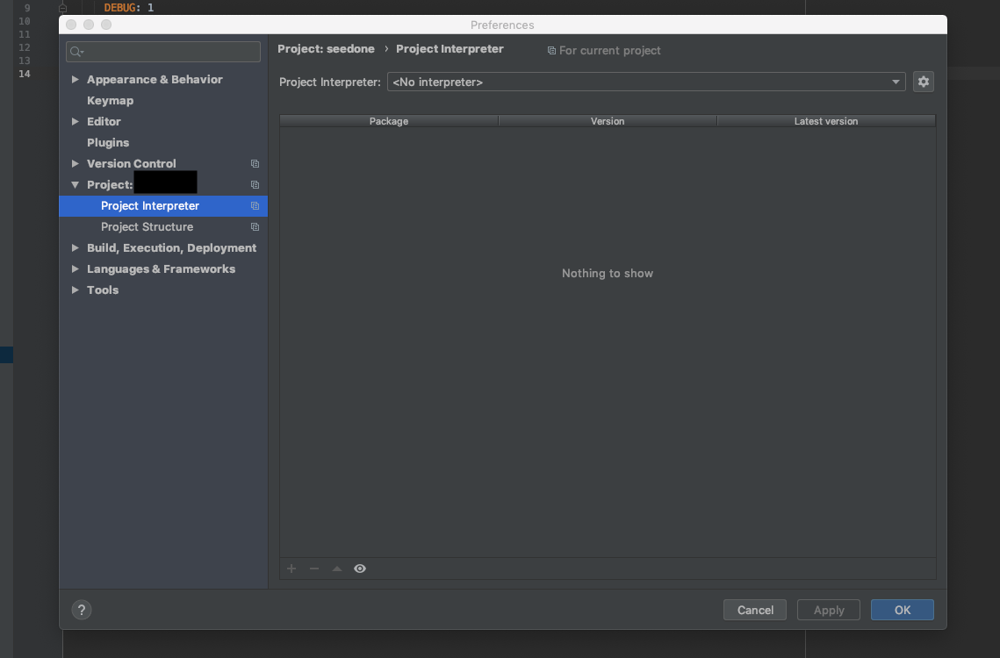
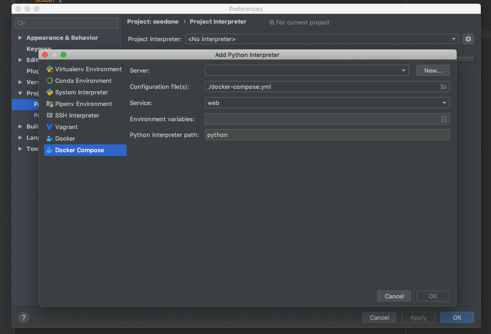
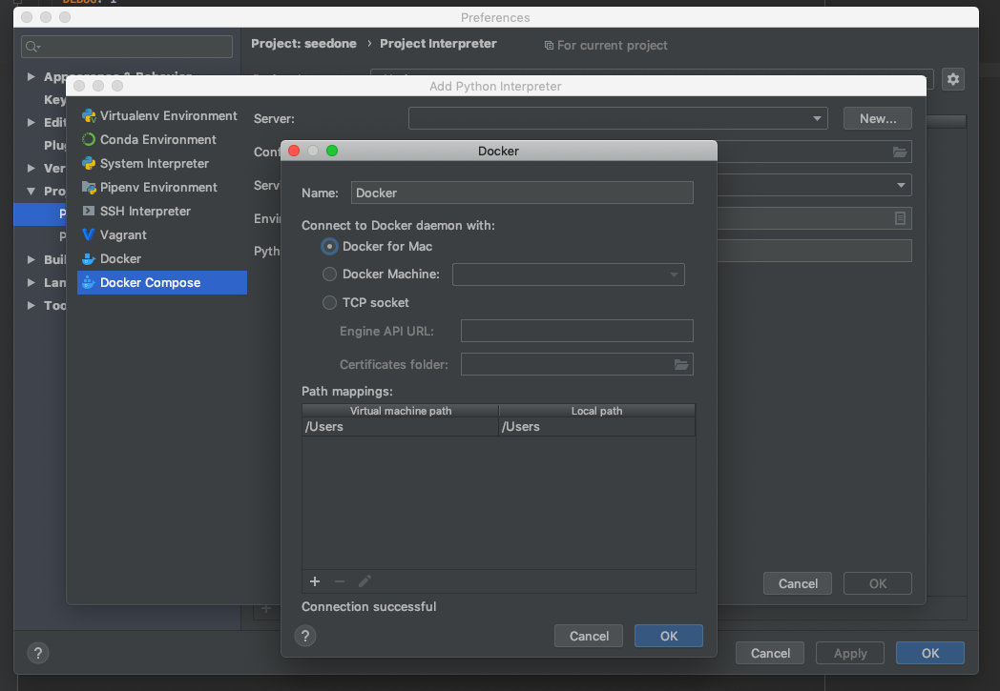
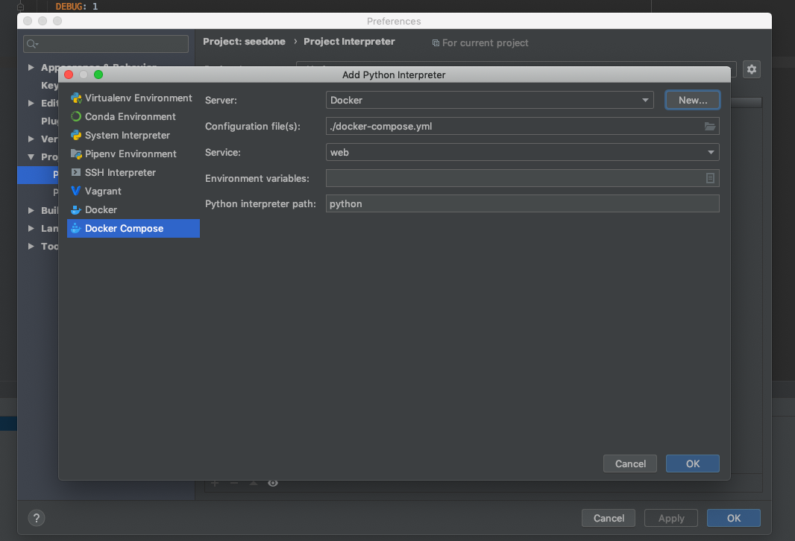
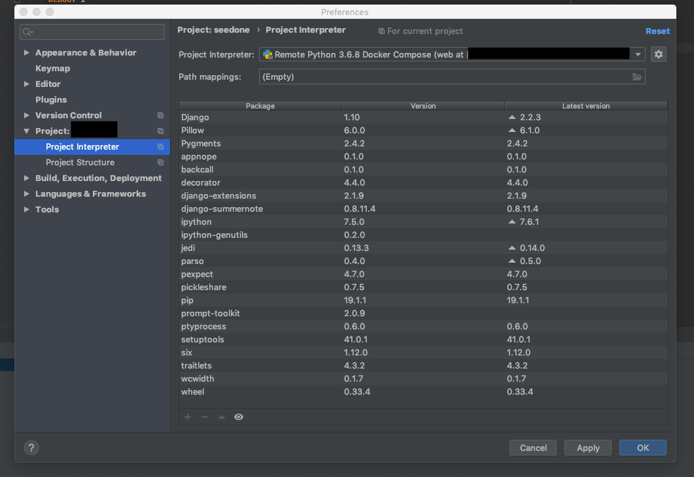

### 사전 준비

1. docker 설치

   pycharm에서 docker를 사용하는 방법은 몇가지가 존재하지만 ~~나머지는 저도 안해봤기때문에~~ 그중에서 PC에 설치된 docker를 이용하는 법을 알려드리려고 합니다.

   [Docker docs](https://docs.docker.com/) 에 들어가서 가입 후 다운로드 하시면 됩니다.

2. docker 및 docker-compose 파일 셋팅

   사용하시는 환경에 따라 docker 및 docker-compose파일을 설정을 하시면 됩니다.
   이 블로그는 Django를 기준으로 작성을 하겠습니다.

   ```yaml
   # Dockerfile
   FROM python:3.6.8
   
   ADD ./requirements.txt /code/requirements.txt
   WORKDIR /code
   
   RUN pip install -r requirements.txt
   ```

   ```yaml
   # docker-compose.yml
   version: '3'
   
   services:
     web:
       build: .
       restart: always
       command: python manage.py runserver 0.0.0.0:8000
       environment:
         DEBUG: 1
       volumes:
         - .:/code
       ports:
         - '8000:8000'
   
   ```


### pycharm 셋팅

1. Preferences(⌘ + ,) 를 엽니다

2. Project -> Project Interpreter를 클릭합니다.

   

3. 우상단에 위치한 톱니바퀴 모양을 클릭 후 `Add` 버튼을 클릭합니다.

4. 좌측 메뉴 리스트의 `docker compose` 를 클릭 합니다.

   

5. Server옆의 `New…` 버튼을 클릭 합니다.

6. Name은 편하게 적으시면 되며, Connet to Docker daemon with: 항목에 `Docker for Mac` 이 잘 선택되어 있는 상태로 OK를 클릭합니다.

   

7. 잘 완료가 되었다면 Server 항목에 6.번에서 정한 이름이 들어가 있을 겁니다.환경 변수가 필요하다면 Eviroment variables에 작성을 해주시면 되며 OK를 클릭하며 마칩니다.
	

9. 정상적으로 완료가 되었다면 Project Iterpreter에 Remote Python <version> Docker Compose… 이라는 항목이 나타납니다.(이름은 docker 환경에 따라 다를 수 있습니다. )
   

10. Apply 후 OK를 누르게 되면 Pycharm에서 필요한 초기 셋팅이 Background Tasks에서 진행이 됩니다. 
11. 끗!

